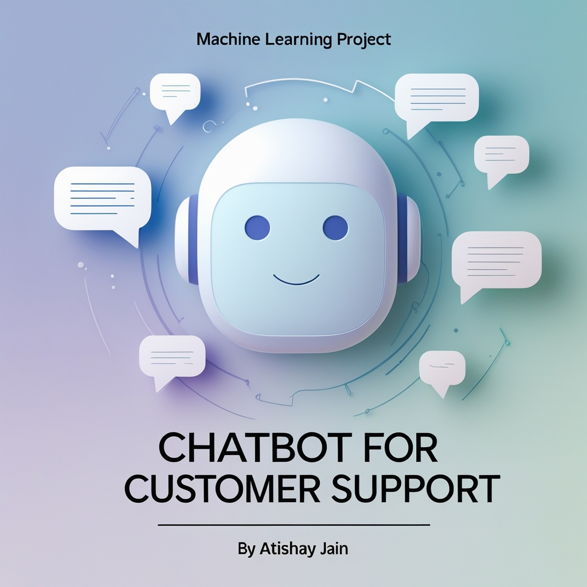
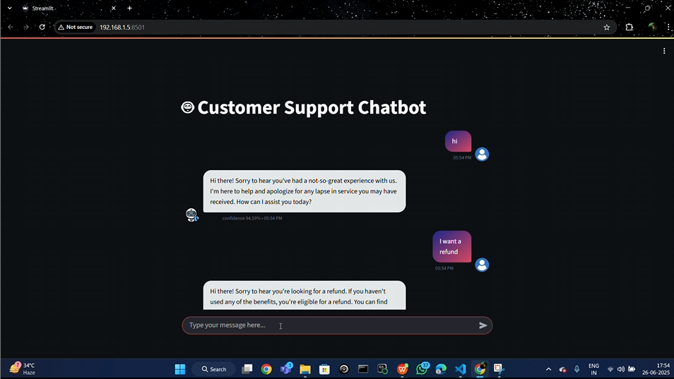

# Chatbot for Customer Support

◦ Built an AI-powered customer support chatbot capable of answering real-world queries using Retrieval-Augmented Generation (RAG) and LLM integration.
<br>
◦ Designed and implemented an intent generation pipeline to convert 100K+ tweet-based support data into structured JSON formats.
<br>
◦ Leveraged FAISS and HuggingFace sentence embeddings to store and retrieve contextually relevant responses efficiently.
<br>
◦ Integrated Groq’s LLaMA3-70B API via LangChain to generate polite, accurate, and grounded answers within a Streamlit-based chat interface.
<br>
◦ Achieved intelligent user interaction with styled avatars, session continuity, and confidence scoring, enhancing customer experience and support automation.
<br>

<h3 align="left">Simulation:</h3>
<p align="left">
<a href="https://github.com/atishayj4in/Dog_and_Cat_Classifier" target="blank"></a>

# 🤖 Chatbot Setup Guide

This guide walks you through the steps required to set up and run the chatbot locally using Streamlit and Groq LLM.

---

## 🧰 Prerequisites

- Python 3.8 or higher
- Virtual environment tool (`venv` or `virtualenv`)
- A Groq API key (get it from [Groq Console](https://console.groq.com/))

---

## ⚙️ Installation & Setup

### 1️⃣ Create a Virtual Environment

```bash
python -m venv venv
source venv/bin/activate  # On Windows: venv\Scripts\activate
pip install -r requirements.txt
```

---

### 2️⃣ Configure the Groq API Key

#### 🔐 Step A: Add API Key to `.env`

Create a `.env` file in the root directory (if not already present) and add:

```
GROQ_API_KEY=your_groq_api_key_here
```

#### 🛠 Step B: Update `connect_memory_with_llm.py`

Open `connect_memory_with_llm.py` and locate the section with the comment:

```python
# Paste your API key here
```

Replace or add:

```python
groq_api_key = "your_groq_api_key_here"
```

---

### 3️⃣ Add Your Data

Place your customer data CSV file in the `data/` directory.

> ⚠️ **Note:** This chatbot has been tested with datasets up to **100,000 rows**.

Example:

```plaintext
project-root/
└── data/
    └── customer_data.csv
```

---

### 4️⃣ Generate Intents

Run this script to generate the `intents.json` file from your dataset:

```bash
python intent_generation.py
```

---

### 5️⃣ Build Vector Memory (FAISS)

Create vector embeddings and store them in a FAISS index:

```bash
python create_memory_for_llm.py
```

> ⏳ This step may take a few minutes depending on your dataset size.

---

### 6️⃣ Launch the Chatbot

Use Streamlit to run the chatbot:

```bash
streamlit run chatbot.py
```

Open your browser and visit:

```
http://localhost:8501
```

---

## ✅ You're All Set!

Your chatbot is now running locally!  
You can now interact, test, and enhance it as needed.

---

## 📁 Project Structure Overview

```plaintext
├── data/
│   └── chatbot_data.csv
│   └── intents.json
│
├── vectorstore/
│   └── db_faiss/
│       └── index.faiss
│       └── index.pkl
│
├── venv/                          # Virtual environment folder
│
├── .env                           # Environment file with Groq API key
├── chatbot.py                     # Main chatbot launcher (Streamlit)
├── connect_memory_with_llm.py     # Connects LLM with vector DB
├── create_memory_for_llm.py       # Script to generate vector memory
├── intent_generation.py           # Generates intents.json from CSV
├── requirements.txt               # Python dependencies
```
